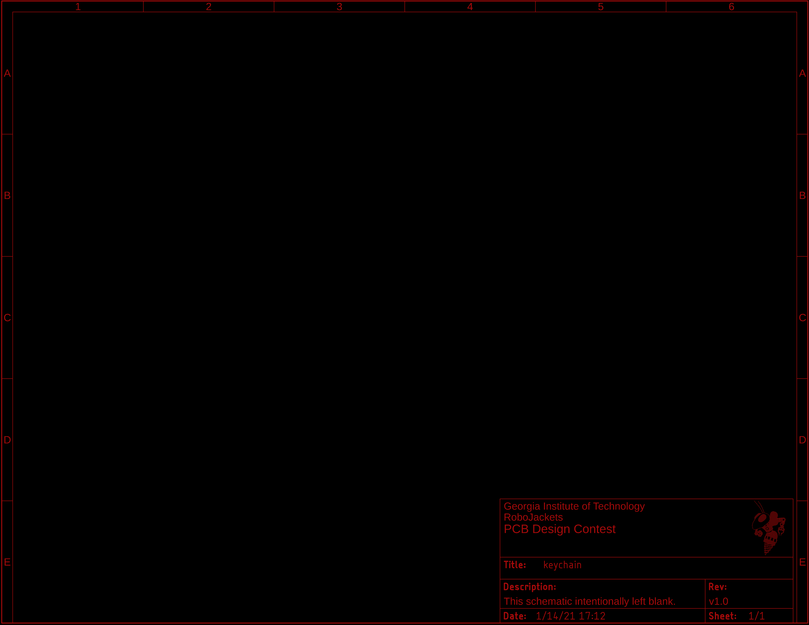
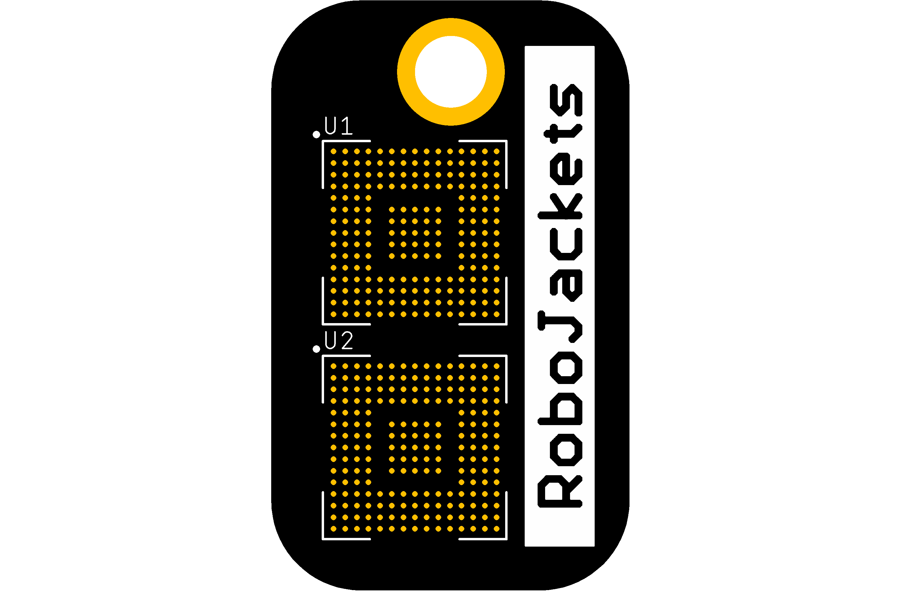
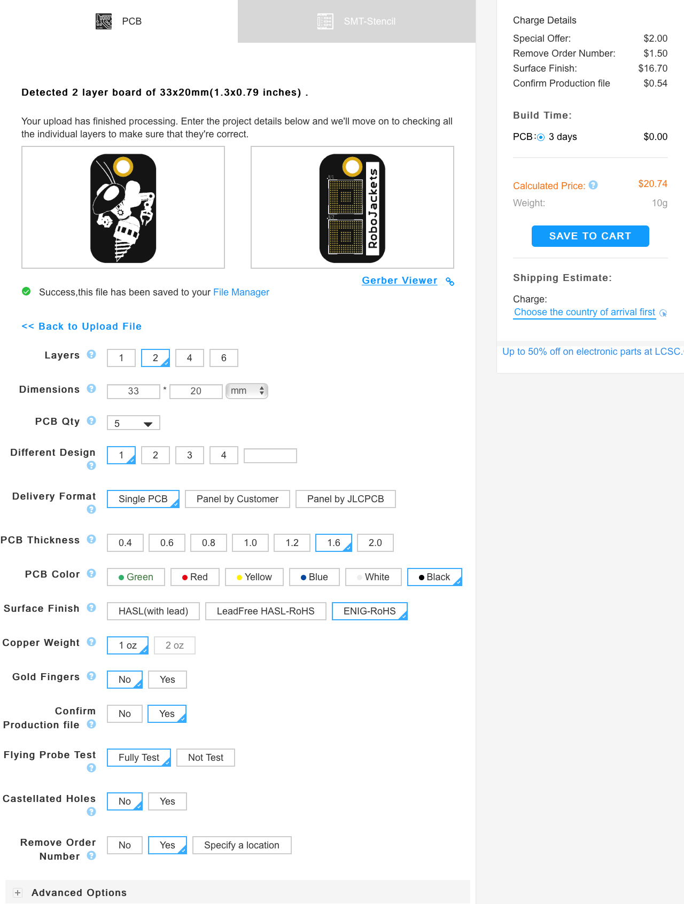
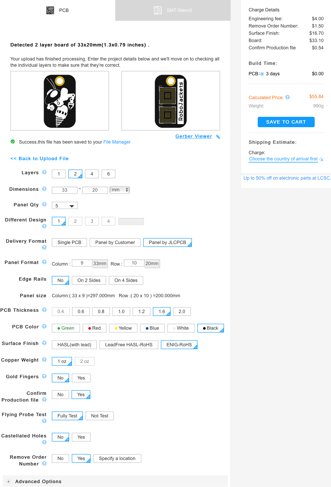

# Keychain

## Overview

This is a simple board to serve as a pretty keychain while being cheap ($4.148 per the [BOM](BOM.csv)). The board is designed to be manufactured using **JLCPCB** and is a regular 2 layer board with black soldermask and an ENIG finish for aesthetics.

## Circuit

This board does not have any actual circuitry.

## Firmware

This board does not have any programmable components so no firmware is required.

## Images

Schematic:

Board:

## Ordering

Please use the provided [Gerber](Keychain.zip) for orders on JLCPCB.

For ordering individual boards, use the following settings:

For ordering panelized boards, use the following settings:

